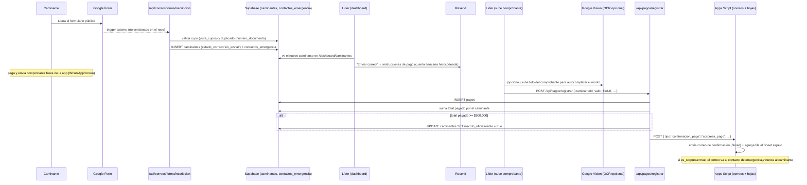
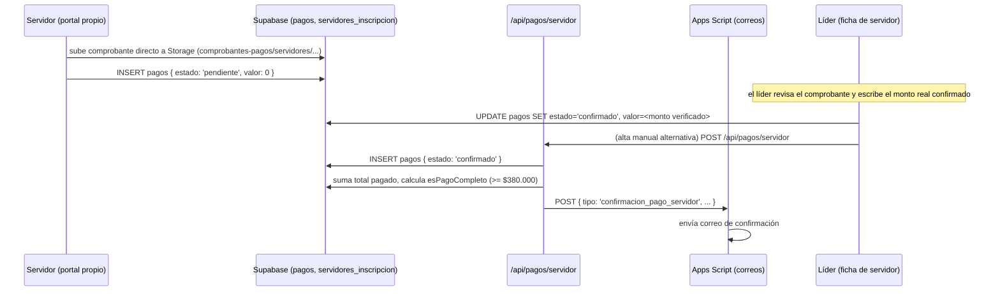
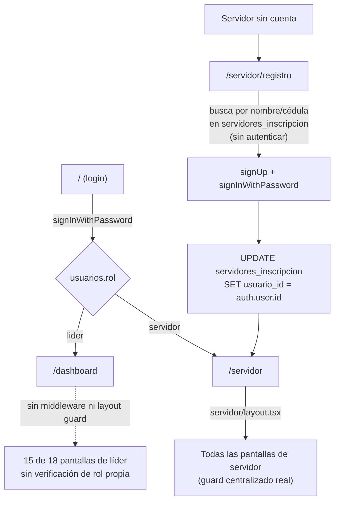
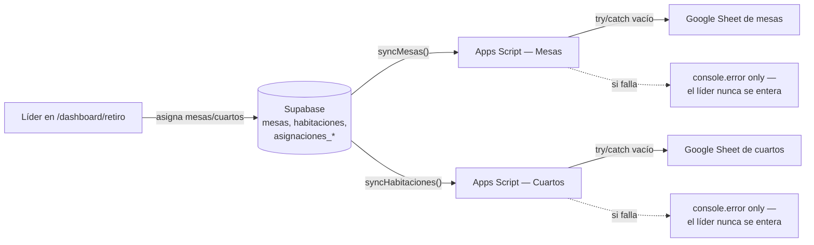

# DATA_FLOW — Diagrama de flujo de datos

> Diagramas en Mermaid (se renderizan automáticamente en GitHub). Ver `ARCHITECTURE.md` para el
> detalle del stack y `EXTERNAL_INTEGRATIONS.md` para el detalle de cada integración marcada aquí.

## 1. Mapa de sistemas conectados

```mermaid
flowchart LR
    subgraph Cliente["Navegador (líder / servidor)"]
        UI["Páginas Next.js\n'use client'"]
    end

    subgraph Vercel["Next.js en Vercel"]
        API["10 rutas /api\n(service role key)"]
    end

    subgraph SB["Supabase — fuente de verdad"]
        DB[("Postgres\n~24 tablas/vistas")]
        AUTH["Auth\n(email + magic link)"]
        STORE["Storage\ncomprobantes-pagos"]
        RT["Realtime\npostgres_changes"]
    end

    RESEND["Resend\ncorreo transaccional"]
    VISION["Google Vision API\nOCR de comprobantes"]
    SCRIPTS["4× Google Apps Script\n(código fuera del repo,\nsin auth, fire-and-forget)"]
    SHEETS["Google Sheets\nespejo de inscritos +\ncotizaciones de proveedores"]
    GMAIL["Gmail\n(vía Apps Script)\ncorreos de confirmación de pago"]
    FORM["Google Form\npre-inscripción pública"]

    UI -- "anon key, directo" --> DB
    UI -- "anon key" --> AUTH
    UI -- "anon key" --> STORE
    UI -- "suscripción" --> RT
    UI -- "API key + OAuth implícito\nen el bundle público" -.-> SHEETS

    UI --> API
    API -- "service role key" --> DB
    API --> RESEND
    API -- "base64 de imagen" --> VISION
    API --> SCRIPTS

    SCRIPTS --> SHEETS
    SCRIPTS --> GMAIL
    FORM -. "trigger externo,\nno visible en este repo" .-> API

    style SCRIPTS fill:#3a2510,stroke:#ac5300
    style SHEETS fill:#1b1d29,stroke:#ac5300
```

**Líneas punteadas:** conexiones que evitan por completo las rutas API de Next.js. El navegador
habla directo con la API de Google Sheets (pestaña "Cotizaciones" de finanzas) y el Google Form
dispara la pre-inscripción por su cuenta, mediante un trigger que no está en este repositorio.

## 2. Ciclo de vida de un caminante: de la pre-inscripción al cupo confirmado

El umbral de `$500.000` y el cupo máximo no viven en una tabla de configuración: son literales
repetidos en varios archivos (`dashboard/caminantes/[id]/page.tsx`, `api/pagos/registrar/route.ts`).
Ver `HARDCODED_RETREAT_DATA.md`.

## 3. Flujo de pago de un servidor interno

Nótese que la confirmación de un pago pendiente puede hacerse de dos maneras distintas dentro del
mismo flujo: edición directa de la fila `pagos` desde la ficha del servidor, o vía
`/api/pagos/servidor`. Ninguna de las dos valida del lado del servidor que quien confirma tenga
efectivamente rol de líder (ver `USER_ROLES.md`).

## 4. Autenticación y enrutamiento por rol

## 5. Sincronización de logística del retiro (mesas y cuartos)

## 6. Notificaciones — dos fuentes que no coinciden entre sí

`app/dashboard/page.tsx` calcula su propio contador de alertas
(`reembolsosPendientes + alertasAsistencia`), mientras que `app/notifications/page.tsx` agrega **6**
fuentes distintas (pagos pendientes, caminantes nuevos, alertas de asistencia, reembolsos
pendientes, mensajes recientes, actualizaciones de Palancas) de forma completamente independiente,
sin estado de lectura persistido. El número que ve el líder en la campana del dashboard y el
contenido real del feed de notificaciones son dos cálculos separados que pueden no coincidir.

## 7. Ver también

- `EXTERNAL_INTEGRATIONS.md` — detalle de cada sistema externo mencionado en estos diagramas.
- `DATABASE_SCHEMA.md` — columnas completas de cada tabla involucrada.
- `HARDCODED_RETREAT_DATA.md` — todos los valores literales (montos, umbrales, URLs) que aparecen
  en estos flujos.
