# IMPLEMENTATION_ROADMAP — Hoja de ruta de implementación

> Sintetiza los 8 documentos de auditoría (`SYSTEM_MAP.md` … `MULTI_RETREAT_MIGRATION_PLAN.md`) y la
> arquitectura objetivo a 5 años discutida en conversación (modelo `persona` + `retiro_participacion`)
> en una secuencia de fases ejecutables. Sigue siendo un documento de planificación — no se ha
> escrito ni modificado código de la aplicación para producirlo.

## Cómo leer este documento

- Cada fase tiene: **Objetivo**, **Resultado esperado**, **Criterios de éxito**, **Riesgo de romper
  funcionalidades existentes**, dependencias, y sus cambios específicos de base de datos / frontend
  / backend.
- Al final hay tres secciones transversales que el resto del documento referencia: la
  **estrategia de migración de datos** (el tramo más delicado, específico de la Fase 4), un
  **resumen consolidado de cambios** por capa, y el **MVP mínimo** para operar el próximo retiro sin
  tocar código.
- La numeración de fases **reemplaza** la de `MULTI_RETREAT_MIGRATION_PLAN.md`: incorpora el modelo
  Persona + Participación de la arquitectura objetivo en el lugar que le corresponde según riesgo y
  urgencia real, no según qué tan fundacional es en el diseño puro. Esa distinción se explica en la
  Fase 4.

---

## Mapa de dependencias entre fases

```mermaid
flowchart TD
    F0["Fase 0\nSeguridad y fundaciones"] --> F1["Fase 1\nGuard de rutas centralizado"]
    F1 --> F2["Fase 2\nRetiro como contexto +\nreglas de negocio configurables"]
    F2 --> F3["Fase 3\nSelector, creación\ny clonado de retiro"]
    F2 --> F4["Fase 4\nModelo Persona + Participación"]
    F3 -.opcional antes de.-> F4
    F3 --> F5["Fase 5\nHistorial, estadísticas\ny rachas derivadas"]
    F4 --> F5
    F0 -.puede iniciar en paralelo.-> F6["Fase 6\nIntegraciones externas\nformalizadas"]
    F5 --> F7["Fase 7\nConsolidación y pulido"]
    F6 --> F7

    style F0 fill:#3a1614,stroke:#ff6b60
    style F1 fill:#3a2510,stroke:#ffab5e
    style F2 fill:#23264a,stroke:#7683ff
    style F4 fill:#322b0c,stroke:#e8c84a
```

**MVP operativo = Fase 0 + Fase 1 + Fase 2 completas, más una porción mínima de Fase 3.** Se detalla
al final del documento.

---

## Fase 0 — Seguridad y fundaciones

**Objetivo.** Cerrar las exposiciones ya confirmadas (`USER_ROLES.md` §4, `HARDCODED_RETREAT_DATA.md`
§6) y dejar una base de conocimiento real del sistema (esquema versionado, políticas RLS conocidas)
antes de tocar cualquier otra cosa.

**Resultado esperado.** Ninguna credencial de privilegio elevado vive en el código fuente ni en el
bundle del navegador. El esquema real de Supabase está exportado y versionado. Se conoce, por fin,
el estado real de RLS para las tablas sensibles — cerrando el vacío de información más citado en
toda la auditoría.

**Criterios de éxito.**
- Cero coincidencias de `effeta2026admin`, la API key de Sheets y el OAuth Client ID en el código.
- `INSTRUCCIONES.md` documenta las 7 variables de entorno reales, no solo 3.
- Existe al menos un archivo `.sql` versionado con el esquema completo.
- Las políticas RLS de `servidores_inscripcion`, `caminantes`, `pagos` y `transacciones` están
  documentadas, cualquiera sea su estado real.

**Riesgo de romper funcionalidades existentes.** Muy bajo — son cambios de configuración y rotación
de credenciales, no tocan lógica de negocio ni flujos de usuario.

**Dependencias.** Ninguna — es la fase de entrada obligatoria.

**Cambios de base de datos.** Ninguno estructural; posible ajuste de políticas RLS si la revisión
encuentra huecos.

**Cambios de frontend.** Ninguno.

**Cambios de backend.** Retirar la clave fija de `/api/admin/impersonate/route.ts` (o eliminar la
ruta si no se justifica su existencia en producción); mover a variables de entorno la URL de
Supabase y las 4 URLs de Apps Script hoy hardcodeadas.

---

## Fase 1 — Guard de rutas centralizado

**Objetivo.** Reemplazar la verificación de rol duplicada en 3 de 18 pantallas de líder por un único
punto de control, replicando el patrón que ya funciona en `app/servidor/layout.tsx`.

**Resultado esperado.** Ninguna pantalla de `/dashboard/*` depende de que un desarrollador recuerde
copiar el chequeo de rol — existe una sola vez, en un solo lugar.

**Criterios de éxito.**
- `app/dashboard/layout.tsx` (o `middleware.ts`) verifica sesión y `rol === 'lider'` antes de
  renderizar cualquier pantalla del portal.
- Las verificaciones manuales duplicadas en `palancas`, `reuniones` y `mensajes` pueden retirarse
  sin cambiar el comportamiento observado.
- Un usuario con rol `servidor` que navega directamente a cualquier URL de `/dashboard/*` es
  redirigido, sin excepción.

**Riesgo de romper funcionalidades existentes.** Bajo. Es aditivo por naturaleza — el riesgo
principal es bloquear por error una ruta que debía quedar accesible (por ejemplo, si alguna pantalla
de `/dashboard` resulta ser usada también por servidores en algún flujo no documentado). Mitigación:
recorrer manualmente las 18 pantallas antes de dar la fase por cerrada.

**Dependencias.** Fase 0 (no tiene sentido centralizar el guard sobre una base con la puerta trasera
de administración todavía abierta).

**Cambios de base de datos.** Ninguno.

**Cambios de frontend.** Nuevo `app/dashboard/layout.tsx`; simplificación de las 3 pantallas con
guard duplicado.

**Cambios de backend.** Ninguno (a menos que se opte por `middleware.ts` en vez de un layout, en
cuyo caso el guard vive a nivel de Edge/servidor).

---

## Fase 2 — Retiro como contexto + reglas de negocio configurables

**Objetivo.** Eliminar el bloqueador estructural número uno (`RETIRO_ID` hardcodeado en 20+
archivos) y mover los valores de negocio que hoy son literales (precios, cupo, meta, fechas, datos
bancarios) a las columnas que `retiros` ya tiene o a una nueva tabla `retiro_configuracion`.

**Resultado esperado.** Ningún archivo de la aplicación contiene un UUID de retiro escrito a mano.
Los precios de inscripción, el cupo, la meta de recaudo y las fechas se leen siempre de la base de
datos. La inconsistencia de precio de servidor ($380.000 vs $260.000) queda corregida como
consecuencia directa de tener una sola fuente de verdad.

**Criterios de éxito.**
- Un grep de la app por el UUID actual del retiro (`21da7588-...`) no devuelve resultados.
- `perfil/page.tsx` muestra las fechas reales de `retiros.fecha_inicio/fecha_fin`, no texto fijo.
- El roster del equipo Palancas deja de vivir en un arreglo de UUIDs en el código y pasa a ser una
  consulta en vivo por `grupo = 'palancas'`.
- Existe una pantalla (aunque sea simple) donde un líder edita precios, cupo, meta, fechas y datos
  bancarios sin tocar código.

**Riesgo de romper funcionalidades existentes.** Medio-alto — es la fase de mayor superficie de
cambio de todo el roadmap (toca 20+ archivos que hoy funcionan en producción). Mitigación: hacerlo
módulo por módulo (primero pantallas de solo lectura, después las de escritura crítica como registro
de pagos), con una verificación manual de cada pantalla tocada antes de continuar con la siguiente.

**Dependencias.** Fase 1.

**Cambios de base de datos.** Nuevas columnas en `retiros` (`costo_caminante`,
`costo_servidor_interno`); nueva tabla `retiro_configuracion` (1:1 con `retiros`) para datos
bancarios e identidad de la organización.

**Cambios de frontend.** Un hook/contexto `useRetiroActual()` que reemplaza los literales;
ampliación de `dashboard/config` para editar la nueva configuración; Palancas consume la consulta en
vivo en vez del arreglo hardcodeado.

**Cambios de backend.** Las rutas `/api/pagos/registrar` y `/api/pagos/servidor` dejan de tener
`valorTotal`/`VALOR_TOTAL` como constantes y los leen de `retiro_configuracion`.

---

## Fase 3 — Selector, creación y clonado de retiro

**Objetivo.** Permitir operar más de un retiro sin editar la base de datos a mano — crear uno nuevo,
elegir cuál está activo, y ver los anteriores en modo lectura.

**Resultado esperado.** Un líder puede, desde la interfaz, crear la siguiente edición del retiro
clonando la configuración de una anterior (categorías financieras, estructura de roles), y cambiar
cuál retiro está activo sin intervención de un desarrollador.

**Criterios de éxito.**
- Pantalla de lista de retiros con estado visible.
- Flujo de "crear retiro nuevo" con opción de clonar desde uno existente.
- Retiros en estado `cerrado`/`archivado` son navegables pero no editables.
- Ninguna pantalla existente deja de funcionar al cambiar cuál retiro está activo (validación
  cruzada: repetir el recorrido manual de la Fase 2 sobre un segundo retiro real de prueba).

**Riesgo de romper funcionalidades existentes.** Bajo-medio. Es mayormente aditivo (pantallas
nuevas), pero introduce el primer escenario real de "más de un retiro con datos simultáneos", que es
precisamente donde `dashboard/asistencias/page.tsx` (sin filtro por `retiro_id`) fallaría — corregir
ese filtro es parte obligatoria de esta fase, no opcional.

**Dependencias.** Fase 2.

**Cambios de base de datos.** `retiros.clonado_de` (auto-referencia opcional); enriquecer
`retiros.estado` más allá de `activo/archivado` si se quiere modelar el ciclo de vida completo
(planificación → inscripciones abiertas → en curso → cerrado → archivado) — opcional para esta fase,
no bloqueante.

**Cambios de frontend.** Pantalla de selector de retiro; flujo de creación/clonado; auditoría de
filtros por `retiro_id` faltantes en pantallas existentes (ej. asistencias).

**Cambios de backend.** Lógica de clonado (copiar categorías financieras y estructura de roles desde
un retiro plantilla al nuevo).

---

## Fase 4 — Modelo Persona + Participación

**Objetivo.** Introducir la identidad unificada de persona (`persona`, `persona_salud`) y el modelo
de participación por retiro (`retiro_participacion` + `participacion_caminante` /
`participacion_servidor`) descrito en la arquitectura objetivo, migrando `caminantes` y
`servidores_inscripcion` hacia él.

**Por qué va aquí y no antes.** En la conversación de arquitectura objetivo se identificó este
modelo como "lo primero que construiría" mirando solo las dependencias internas del diseño —
historial y estadísticas lo dan por hecho. Pero operar el próximo retiro **no** depende de este
modelo: `caminantes` y `servidores_inscripcion` ya tienen `retiro_id`, así que un retiro nuevo ya
genera filas nuevas correctamente sin él. Este roadmap prioriza primero lo que de verdad bloquea la
operación (Fases 0-3, menor riesgo, mayor urgencia) y deja esta migración —la más delicada de
datos de todo el plan— para cuando ya exista una base estable de multi-retiro sobre la cual
validarla.

**Resultado esperado.** Una persona que participó como caminante en una edición y como servidor en
otra queda representada como la misma identidad, con historial visible. Los campos que hoy generan
inconsistencias entre las dos tablas (`inscrito_oficialmente`, `estado_correo`) quedan modelados
como reglas explícitas por rol dentro del mismo esquema.

**Criterios de éxito.** Ver la sección dedicada de **Estrategia de migración de datos** más abajo —
esta fase tiene criterios de validación propios y más estrictos que las anteriores, dado el riesgo.

**Riesgo de romper funcionalidades existentes.** Alto. Es una migración de datos real sobre
información sensible (salud, pagos, contactos de emergencia). El riesgo concreto es duplicar o
fusionar incorrectamente personas por errores de normalización de `numero_documento`, o perder el
vínculo de un pago/contacto de emergencia al mover su fila de padre. Mitigación detallada abajo.

**Dependencias.** Fase 2 (idealmente Fase 3 también, para validar la migración sobre un segundo
retiro real y no solo el IX).

**Cambios de base de datos.** Nuevas tablas `persona`, `persona_salud`, `retiro_participacion`,
`participacion_caminante`, `participacion_servidor`; `palancas_seguimiento.caminante_id` (FK real) en
reemplazo de `caminante_nombre` (texto); `pagos.persona_id` y `contactos_emergencia.persona_id`
repuntados hacia las nuevas tablas.

**Cambios de frontend.** Ficha de persona unificada con historial de participaciones; formularios de
alta que distinguen identidad (una vez) de participación (cada edición); badge interno/externo y
demás componentes duplicados se consolidan como parte natural de esta fase (ya no tiene sentido
mantener 3 copias sobre un modelo que dejó de existir en su forma vieja).

**Cambios de backend.** Script de migración/backfill (ver estrategia abajo); rutas `/api/pagos/*` y
`/api/caminantes/[id]` actualizadas para escribir sobre el nuevo modelo.

---

## Fase 5 — Historial multi-año, estadísticas y rachas derivadas

**Objetivo.** Construir las capacidades que el modelo de la Fase 4 habilita: historial de persona
across años, reportes comparativos entre ediciones, y rachas de asistencia calculadas del lado del
servidor en vez de en el navegador.

**Resultado esperado.** Un líder puede ver cuántos retiros ha hecho una persona y en qué rol cada
vez; puede comparar recaudo/cupos entre ediciones sin que el reporte se vuelva lento a medida que se
acumulan años; la racha de asistencia de un servidor es un valor confiable, no un cálculo que puede
diferir entre pantallas.

**Criterios de éxito.**
- Vista `persona_historial` operativa y usada en al menos una pantalla real.
- `retiro_estadisticas` se calcula al cerrar un retiro, no en cada carga de pantalla.
- La racha de asistencia coincide sin importar desde qué pantalla se consulte.

**Riesgo de romper funcionalidades existentes.** Medio. El riesgo principal es heredado de la Fase
4: si la migración dejó participaciones huérfanas o mal vinculadas, las estadísticas construidas
sobre ellas heredan ese error de forma silenciosa. Por eso esta fase no debería iniciar hasta que la
Fase 4 haya pasado su propia validación cruzada.

**Dependencias.** Fase 4 (fuerte) y Fase 3 (para que "histórico" tenga más de un retiro real que
comparar).

**Cambios de base de datos.** `retiro_estadisticas`, vista/tabla `persona_historial`; columna de
racha derivada (actualizada por trigger o job) en vez de recalculada en cada carga.

**Cambios de frontend.** Pantallas de historial de persona y de comparación entre retiros; reemplazo
del cálculo de racha en `servidor/asistencias/page.tsx` por el valor ya calculado.

**Cambios de backend.** Job o trigger de recálculo de `retiro_estadisticas` al cambiar el estado de
un retiro a `cerrado`; trigger/función de actualización de racha al registrar una asistencia.

---

## Fase 6 — Integraciones externas formalizadas

**Objetivo.** Resolver el punto más frágil de toda la arquitectura actual: los 4 Google Apps Script
sin código versionado, sin autenticación, con fallos silenciosos.

**Resultado esperado.** Depende de una decisión de producto previa (documentada como pendiente en
`MULTI_RETREAT_MIGRATION_PLAN.md` Fase 5): o se formaliza la integración con Google del lado del
servidor usando `googleapis` (ya instalado, sin usar hoy), o se retira el espejo en Sheets ahora que
Supabase es la fuente de verdad para casi todo, conservando solo lo estrictamente necesario.

**Criterios de éxito.**
- Se completó primero la tarea de investigación: leer el código real de los 4 Apps Script antes de
  comprometerse a un camino.
- Cero llamadas cliente-a-Google directas con credenciales expuestas (corrige el hallazgo crítico de
  `dashboard/finanzas` — Cotizaciones).
- Cualquier sincronización que se conserve tiene manejo de error real, visible para el líder, no
  solo `console.error`.
- `retiro_integraciones` (o el campo equivalente en `retiro_configuracion`) permite que cada retiro
  tenga sus propios identificadores de Form/Sheet sin tocar código.

**Riesgo de romper funcionalidades existentes.** Variable, y potencialmente alto si se subestima:
retirar o reemplazar un Apps Script sin haber confirmado primero qué hace exactamente puede eliminar
en silencio una notificación o sincronización que el equipo daba por sentada (por ejemplo, si el
script de correos también actualiza una hoja que alguien sigue consultando manualmente).

**Dependencias.** Puede iniciar en paralelo con la Fase 0 en su tramo de investigación (leer el
código de los scripts no depende de nada más), pero el cambio de producción debería esperar a que
Fase 2 ya tenga `retiro_configuracion` lista para alojar los nuevos identificadores.

**Cambios de base de datos.** `retiro_integraciones` (o columnas equivalentes en
`retiro_configuracion`).

**Cambios de frontend.** El flujo de "Cotizaciones" de finanzas deja de manejar OAuth en el
navegador.

**Cambios de backend.** Nueva integración server-side con `googleapis` (si se elige el camino a), o
retiro de las llamadas a Apps Script (si se elige el camino b) en `/api/pagos/registrar`,
`/api/pagos/servidor`, `/api/sync-palanca`, `/api/caminantes/[id]` y `dashboard/retiro`.

---

## Fase 7 — Consolidación y pulido

**Objetivo.** Cerrar la deuda de duplicación y las funcionalidades a medias que quedaron
identificadas en la auditoría pero no eran bloqueantes para ninguna fase anterior.

**Resultado esperado.** Un único componente de badge interno/externo, un único panel de Palancas,
una única función de emparejamiento de nombres; funcionalidades a medias (modo oscuro,
auto-expiración de mensajes, estado de "leído") terminadas o retiradas del texto que las promete.

**Criterios de éxito.** Cada ítem de `ARCHITECTURE.md` §5-6 y `SYSTEM_MAP.md` §6 resuelto
individualmente — esta fase se puede medir como una checklist plana, no tiene una métrica única.

**Riesgo de romper funcionalidades existentes.** Bajo. Es consolidación de componentes ya probados
en producción, sin nueva lógica de negocio de por medio.

**Dependencias.** Fase 5 y Fase 6 (para no consolidar dos veces si algo cambia de forma en el
camino).

**Cambios de base de datos.** Ninguno nuevo — posible limpieza de columnas que quedaron sin uso tras
las fases anteriores (ej. `palancas_lider` si se confirma que es redundante con
`es_lider_palancas`).

**Cambios de frontend.** Consolidación de componentes duplicados; terminar o retirar las
funcionalidades a medias.

**Cambios de backend.** Ninguno mayor.

---

## Estrategia de migración de datos

La única migración de este roadmap con riesgo real de pérdida o corrupción de datos es la de la
**Fase 4** (Persona + Participación). El resto de las fases son adiciones de columnas/tablas nuevas
sin tocar filas existentes, o cambios de código puro. Esta sección detalla solo la migración
delicada.

1. **Preparación (ya cubierta por la Fase 0).** Esquema versionado, RLS conocido, backup reciente
   confirmado antes de escribir una sola línea de migración.
2. **Expansión aditiva.** Crear `persona`, `persona_salud`, `retiro_participacion`,
   `participacion_caminante`, `participacion_servidor` **sin tocar** `caminantes` ni
   `servidores_inscripcion` todavía. Riesgo cero para lo existente — son tablas nuevas y vacías.
3. **Backfill controlado, no una migración SQL ciega.** Un script recorre `caminantes` y
   `servidores_inscripcion` fila por fila:
   - Normaliza `numero_documento` (trim, sin puntos, mayúsculas) y busca si ya existe una `persona`
     con ese documento — si existe, vincula; si no, crea una nueva.
   - Crea la `retiro_participacion` correspondiente y su detalle de rol.
   - Cualquier caso ambiguo (documento vacío, duplicado con datos distintos entre sí) se registra en
     una tabla de excepciones para revisión manual — **nunca se adivina ni se descarta en
     silencio**.
4. **Periodo de doble escritura.** Mientras la migración se valida, la aplicación sigue operando
   sobre las tablas viejas; el backfill puede correrse más de una vez de forma idempotente para
   mantenerlas sincronizadas.
5. **Validación cruzada antes de cortar.** Comparar totales entre ambos modelos: número de
   caminantes, número de servidores, suma de pagos por persona — deben coincidir exactamente antes
   de considerar la migración lista.
6. **Corte gradual, pantalla por pantalla.** Se empieza por las de solo lectura (menor riesgo) y se
   termina por las de escritura crítica (registro de pagos, ficha de caminante) — nunca todas a la
   vez.
7. **Periodo de gracia.** Las tablas viejas quedan de solo lectura, sin borrarse, como red de
   seguridad — hasta confirmar con al menos un ciclo completo de retiro operado enteramente sobre el
   modelo nuevo que nada más las necesita.
8. **Retiro final.** Solo entonces se eliminan `caminantes` y `servidores_inscripcion` como tablas
   independientes.

---

## Resumen consolidado de cambios por capa

### Base de datos

| Fase | Cambio |
|---|---|
| 2 | + `retiros.costo_caminante`, `retiros.costo_servidor_interno`; + tabla `retiro_configuracion` |
| 3 | + `retiros.clonado_de`; posible enriquecimiento de `retiros.estado` |
| 4 | + `persona`, `persona_salud`, `retiro_participacion`, `participacion_caminante`, `participacion_servidor`; `palancas_seguimiento.caminante_id` real |
| 5 | + `retiro_estadisticas`, vista `persona_historial`; columna de racha derivada |
| 6 | + `retiro_integraciones` (o extensión de `retiro_configuracion`) |
| 7 | Limpieza de columnas ambiguas/sin uso |

### Frontend

| Fase | Cambio |
|---|---|
| 1 | `app/dashboard/layout.tsx` nuevo |
| 2 | Hook `useRetiroActual()`; ampliación de `dashboard/config`; Palancas dinámico |
| 3 | Selector/creación/clonado de retiro |
| 4 | Ficha de persona unificada; consolidación de badges duplicados |
| 5 | Vistas de historial y comparación entre retiros |
| 6 | Flujo de Cotizaciones sin OAuth en el navegador |
| 7 | Consolidación de componentes; cierre de funcionalidades a medias |

### Backend

| Fase | Cambio |
|---|---|
| 0 | Retiro de credenciales del código; documentación de env vars |
| 2 | `/api/pagos/*` leen montos de `retiro_configuracion` |
| 3 | Lógica de clonado de retiro |
| 4 | Script de migración/backfill; `/api/pagos/*` y `/api/caminantes/[id]` sobre el nuevo modelo |
| 5 | Job/trigger de estadísticas y rachas |
| 6 | Integración `googleapis` server-side, o retiro de llamadas a Apps Script |

---

## MVP mínimo: operar el próximo retiro sin modificar código

Esta es una pregunta distinta a "¿cuál es la arquitectura ideal?" — es "¿cuál es el conjunto más
chico de cambios que permite crear el siguiente retiro, configurarlo, y correrlo por completo desde
la plataforma, sin que un desarrollador toque un archivo?"

**Respuesta: Fase 0 + Fase 1 + Fase 2 completas, más una porción mínima de Fase 3.** No requiere la
Fase 4 (Persona + Participación) — `caminantes` y `servidores_inscripcion` ya tienen `retiro_id`, así
que un retiro nuevo ya genera filas correctamente separadas sin ese modelo. La migración de identidad
unificada es valiosa para la visión a 5 años, pero no es necesaria solo para operar una edición más.

**Objetivo del MVP.** Un líder puede, sin abrir el código ni pedirle nada a un desarrollador: crear
la fila del nuevo retiro, configurar sus precios/cupo/meta/fechas/datos bancarios/integraciones, y
marcarlo como activo — y desde ese momento, toda la aplicación (dashboard, portal de servidor,
correos, pagos, Palancas) opera correctamente sobre esa nueva edición.

**Resultado esperado.** Cero ediciones de código entre el cierre de un retiro y el arranque del
siguiente.

**Criterios de éxito del MVP.**
- Grep del repositorio por el UUID del retiro actual: cero resultados.
- Existe una pantalla de configuración de retiro donde el líder edita: nombre, fechas, cupo, meta,
  precio de caminante, precio de servidor interno, datos bancarios, y (si se conservan) los
  identificadores de Form/Sheets/Apps Script.
- Existe un flujo (aunque sea simple, sin clonado sofisticado) para crear la fila del nuevo retiro y
  marcarlo como activo.
- El roster de Palancas se resuelve en vivo por `grupo = 'palancas'`, no por lista hardcodeada — así
  que un equipo distinto de Palancas en el nuevo retiro no requiere tocar código tampoco.
- Se corrió manualmente el recorrido completo de la app (inscripción, pago, mesas/cuartos, Palancas,
  finanzas) contra un segundo retiro de prueba antes de considerar el MVP cerrado.

**Explícitamente fuera del MVP** (quedan para las fases siguientes, no bloquean operar el próximo
retiro): modelo Persona + Participación, historial multi-año, estadísticas comparativas, rachas
derivadas del lado del servidor, reemplazo completo de Apps Script, consolidación de componentes
duplicados. Son mejoras reales, documentadas y priorizadas en este mismo roadmap — simplemente no
son la condición mínima para que el Retiro X exista sin una intervención de código.
